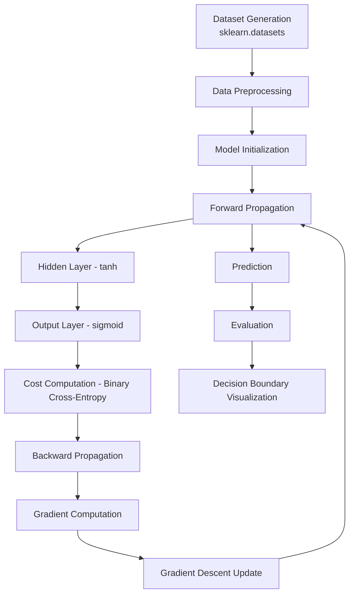

# Planar Data Classification with One Hidden Layer

## Neural Network from Scratch on Planar Datasets

This project implements a two-layer neural network from scratch using NumPy to classify simple 2D planar datasets. It focuses on learning non-linear decision boundaries for datasets such as spirals, moons, circles, and blobs without using high-level machine learning frameworks.

---

## Features

- Two-layer neural network (input → hidden → output)
- Forward propagation implemented manually
- Backward propagation using chain rule
- Binary cross-entropy loss
- Gradient descent optimization
- Decision boundary visualization
- Logistic regression baseline comparison
- Hyperparameter experimentation

---

## Tech Stack

- Python
- NumPy
- Matplotlib
- Scikit-learn

---

## Dataset

Synthetic datasets generated using `sklearn.datasets`:

- Planar dataset
- Noisy circles
- Noisy moons
- Gaussian quantiles
- Random blobs

---

## System Architecture



## Model Architecture

| Layer         | Description |
|--------------|------------|
| Input Layer   | 2 features |
| Hidden Layer  | Configurable (default = 4 neurons) |
| Output Layer  | 1 neuron (binary classification) |

---

## Activation Functions

- Hidden Layer: `tanh`  
- Output Layer: `sigmoid`  

---

## Mathematical Formulation

### Forward Propagation

```python
Z1 = W1 @ X + b1
A1 = np.tanh(Z1)

Z2 = W2 @ A1 + b2
A2 = sigmoid(Z2)
```
### Cost Loss Function
$$
L = -\frac{1}{m} \sum \left[ Y \log(A_2) + (1 - Y)\log(1 - A_2) \right]
$$

### Backward Propagation

Gradients are computed using the chain rule:

```python
# Output layer gradients
dZ2 = A2 - Y
dW2 = (1/m) * np.dot(dZ2, A1.T)
db2 = (1/m) * np.sum(dZ2, axis=1, keepdims=True)

# Hidden layer gradients
dZ1 = np.dot(W2.T, dZ2) * (1 - np.power(A1, 2))
dW1 = (1/m) * np.dot(dZ1, X.T)
db1 = (1/m) * np.sum(dZ1, axis=1, keepdims=True)
```

### Parameter Update

```python
# Update weights and biases using gradient descent
W1 = W1 - alpha * dW1
b1 = b1 - alpha * db1

W2 = W2 - alpha * dW2
b2 = b2 - alpha * db2
```

## Training Pipeline

1. **Initialize parameters** (`W1`, `b1`, `W2`, `b2`)  
2. **Loop for `n` iterations**:  
   - Forward propagation to compute activations  
   - Compute cost using binary cross-entropy  
   - Backward propagation to calculate gradients  
   - Update parameters using gradient descent  
3. Return the trained model  

---

## Evaluation

- Measure **training accuracy**  
- Visualize **decision boundaries** on 2D datasets  
- Compare with **logistic regression** to see linear vs non-linear boundaries  

---

## Key Insight

- **Logistic regression** → Linear decision boundary   
- **Neural network** → Non-linear decision boundary   

---

## Experiments

You can experiment with:

- **Hidden layer size** (`n_h`)  
- **Learning rate** (`alpha`)  
- **Number of training iterations**  
- **Dataset type** (circles, moons, blobs, etc.)  
